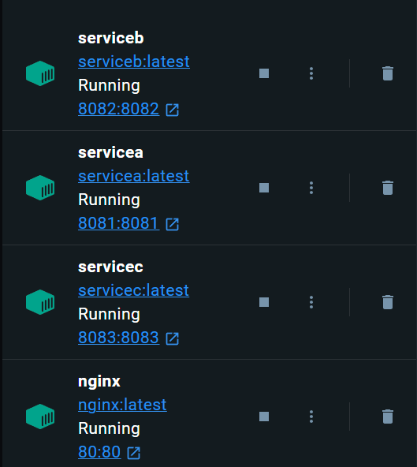

# NGINX

## 소개

- NGINX를 사용해서 간단한 MSA 방식을 구성해보았습니다.
- /serviceA, /serviceB, /serviceC를 호춣해서 URL를 통해 서비스를 구분하고, 접근할 수 있습니다.

## 환경

- Spring Boot
- Docker
- Docker Compose

## 구조도

## 결과 화면

## 보충할 점

- 로드밸런싱
- DB 구성
- 모니터링
- CI/CD

## 참고자료

- [https://velog.io/@solchan/Docker-SpringBoot와-Nginx-Docker-Compose로-서비스-올리기](https://velog.io/@solchan/Docker-SpringBoot%EC%99%80-Nginx-Docker-Compose%EB%A1%9C-%EC%84%9C%EB%B9%84%EC%8A%A4-%EC%98%AC%EB%A6%AC%EA%B8%B0)
- https://hyeon9mak.github.io/nginx-upstream-multi-server/
- [https://jakpentest.tistory.com/entry/NGINX-MultiPle-Upstream-구성하기](https://jakpentest.tistory.com/entry/NGINX-MultiPle-Upstream-%EA%B5%AC%EC%84%B1%ED%95%98%EA%B8%B0)
